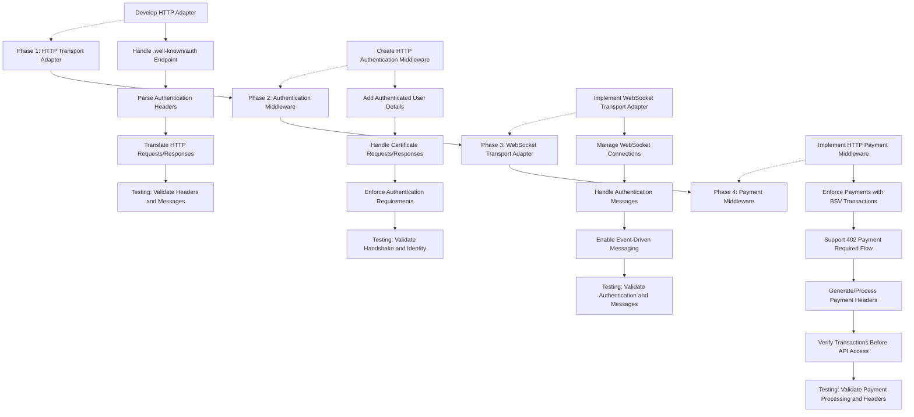

# Project Roadmap

## Table of Contents

1. [Overview](#overview)
2. [Package Structure](#package-structure)
3. [Implementation Phases](#implementation-phases)
    1. [Phase 1: HTTP Transport Adapter](#phase-1-http-transport-adapter)
        - [Required Mocks](#required-mocks)
        - [Testing Goals](#testing-goals)
        - [Example Outcome](#example-outcome)
    2. [Phase 2: Authentication Middleware](#phase-2-authentication-middleware)
        - [Required Mocks](#required-mocks-1)
        - [Testing Goals](#testing-goals-1)
        - [Example Outcome](#example-outcome-1)
    3. [Phase 3: WebSocket Transport Adapter](#phase-3-websocket-transport-adapter)
        - [Required Mocks](#required-mocks-2)
        - [Testing Goals](#testing-goals-2)
        - [Example Outcome](#example-outcome-2)
    4. [Phase 4: Payment Middleware](#phase-4-payment-middleware)
        - [Required Mocks](#required-mocks-3)
        - [Testing Goals](#testing-goals-3)
        - [Example Outcome](#example-outcome-3)
4. [Phases overview](#phases-overview)


## Overview
The goal of this project is to build a robust middleware layer that integrates authentication and payment flows 
into the BSV ecosystem using the go-sdk. The implementation will follow a phased approach, focusing first on transport 
adapters, followed by authentication and payment middleware, and concluding with integration and documentation.

The specification of the project is based on the following BSV specifications:
1. [BRC-103: Peer-to-Peer Mutual Authentication and Certificate Exchange Protocol](https://github.com/bitcoin-sv/BRCs/blob/master/peer-to-peer/0103.md)
2. [BRC-104: HTTP Transport for BRC-103 Mutual Authentication](https://github.com/bitcoin-sv/BRCs/blob/master/peer-to-peer/0104.md)

and on already created TypeScript repositories:
1. [@bsv/auth-express-middleware](https://github.com/bitcoin-sv/auth-express-middleware)
2. [@bsv/payment-express-middleware](https://github.com/bitcoin-sv/payment-express-middleware)

## Package Structure
```
./
├── docs/                         # Documentation and guides
├── examples/                     # Usage examples
│   ├── simple-auth/              # Basic HTTP authentication example
│   ├── websocket-auth/           # WebSocket authentication example
│   └── payment-flow/             # End-to-end payment flow example
├── pkg/                          # Core middleware and transport logic
│   ├── transport/                # Transport layer
│   │   ├── http/                 # HTTP adapter for go-sdk transp.
│   │   └── websocket/            # WebSocket adapter for go-sdk transp.
│   └── middleware/               # Middleware components
│       ├── auth/                 # Authentication middleware
│       └── payment/              # Payment processing middleware
├── internal/                     # Internal utilities and adapters
│   ├── adapter/                  # Transport-specific adaptations
│   │   ├── http/                 
│   │   └── websocket/     
│   └── util/                     
├── testutil/                     # Testing utilities
│   └── mock/                     # Mocks for go-sdk interfaces
├── test/                         # Integration and unit tests
├── LICENSE.md
├── README.md
├── golangci.yml                 
├── go.mod                        
└── go.sum  
```

## Implementation Phases

### Phase 1: HTTP Transport Adapter
We'll start by implementing the HTTP transport adapter to support BRC-104, which enables authentication message exchange over HTTP. This phase will include:
- Developing an HTTP adapter that conforms to the go-sdk Transport interface
- Handling `.well-known/auth` endpoint requests
- Parsing and processing authentication headers
- Translating HTTP requests and responses correctly

#### Required Mocks:
- Transport interface (core message passing)
- AuthMessage structure (BRC-103 message format)
- Basic Peer interface (message handling)

#### Testing Goals:
- Ensure headers are correctly encoded/decoded (BRC-104 compliance)
- Verify `.well-known/auth` endpoint processes handshake messages correctly
- Validate general messages within HTTP headers
- Implement proper error handling for malformed requests

#### Example Outcome:
- A simple HTTP server capable of processing BRC-104 authentication requests

### Phase 2: Authentication Middleware
With the transport layer in place, we’ll develop middleware for handling authentication based on BRC-103. This will include:
- Creating an HTTP middleware for authentication enforcement
- Adding authenticated user details to the request context
- Handling certificate requests and responses
- Enforcing authentication requirements (e.g., allow/deny unauthenticated access)

#### Required Mocks:
- Peer with full authentication flow
- SessionManager for session tracking
- WalletInterface for signature operations
- VerifiableCertificate for certificate validation

#### Testing Goals:
- Validate handshake request processing
- Ensure authenticated identity is correctly stored in request context
- Confirm proper handling of certificate requests/responses
- Enforce authentication policies correctly

#### Example Outcome:
- An API server with protected endpoints requiring authentication
- A client that can authenticate and access those endpoints

### Phase 3: WebSocket Transport Adapter
Next, we’ll build the WebSocket transport adapter to support real-time communication. This phase will focus on:
- Implementing WebSocket support for the go-sdk Transport interface
- Managing WebSocket connections and reconnections
- Handling authentication messages over WebSockets
- Enabling event-driven messaging patterns

#### Required Mocks:
- Similar to the HTTP transport, but with WebSocket-specific behavior

#### Testing Goals:
- Ensure authentication handshakes work over WebSockets
- Validate correct message encoding/decoding
- Maintain authentication state across a connection
- Handle disconnections and reconnections gracefully

#### Example Outcome:
- A real-time chat server with authenticated WebSocket connections
- A client that can connect, authenticate, and exchange messages

### Phase 4: Payment Middleware
With authentication in place, we’ll introduce a payment middleware layer for handling paid API requests. This will include:
- Implementing HTTP middleware to enforce payments using BSV transactions
- Supporting the `402 Payment Required` HTTP flow
- Generating and processing payment headers
- Verifying transactions before allowing API access

#### Required Mocks:
- WalletInterface with transaction handling capabilities
- InternalizeAction for payment processing

#### Testing Goals:
- Ensure middleware correctly calculates API request prices
- Verify `402 Payment Required` responses include valid payment instructions
- Validate parsing and processing of payment headers
- Ensure payments are verified before processing requests
- Prevent payment replay attacks

#### Example Outcome:
- An API server with endpoints requiring payments
- A client capable of making payments for API access

## Phases overview

